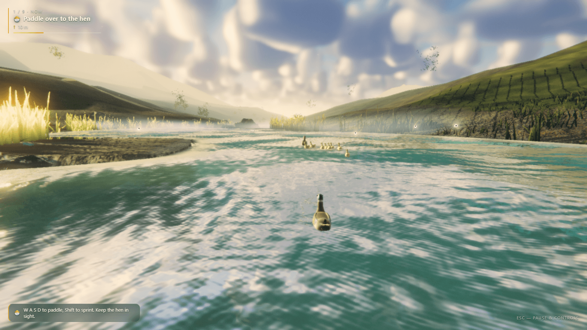
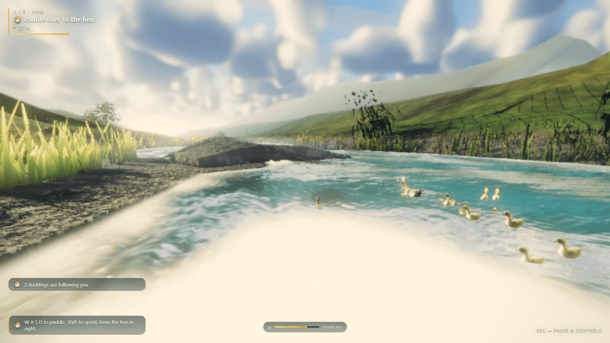
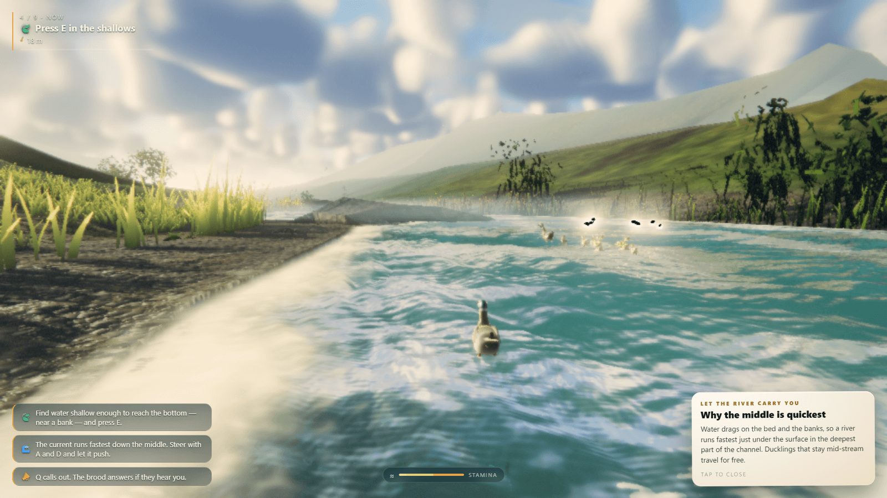
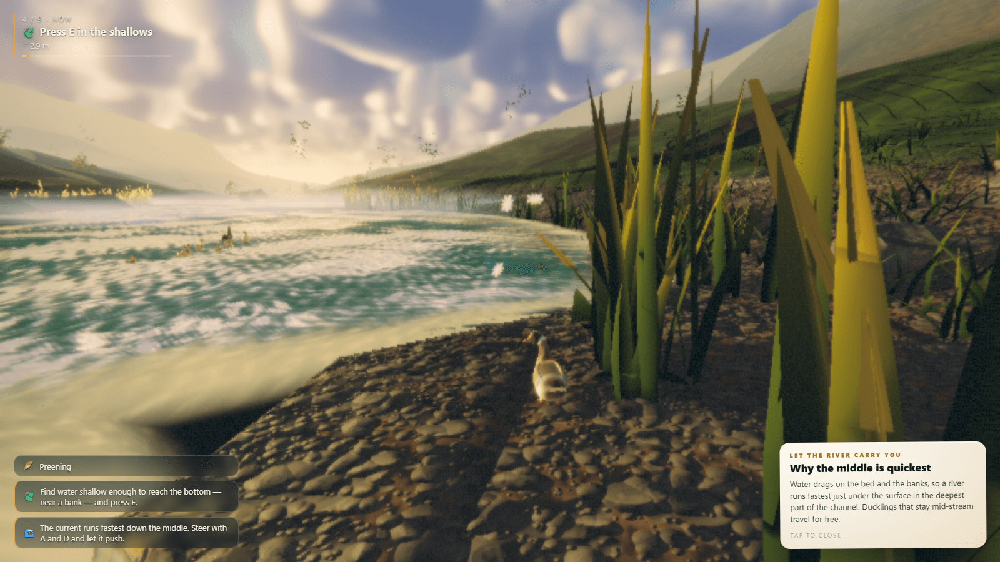
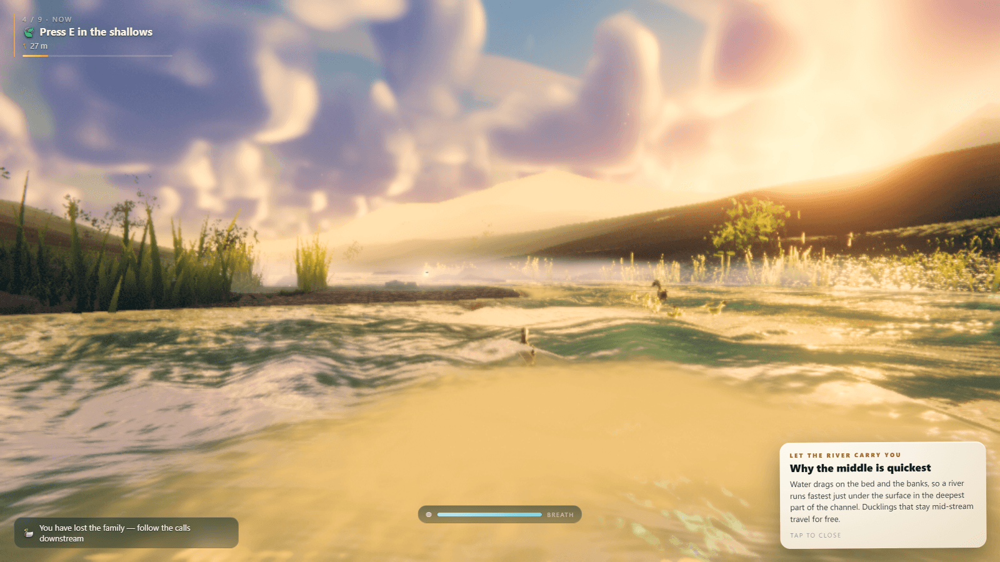
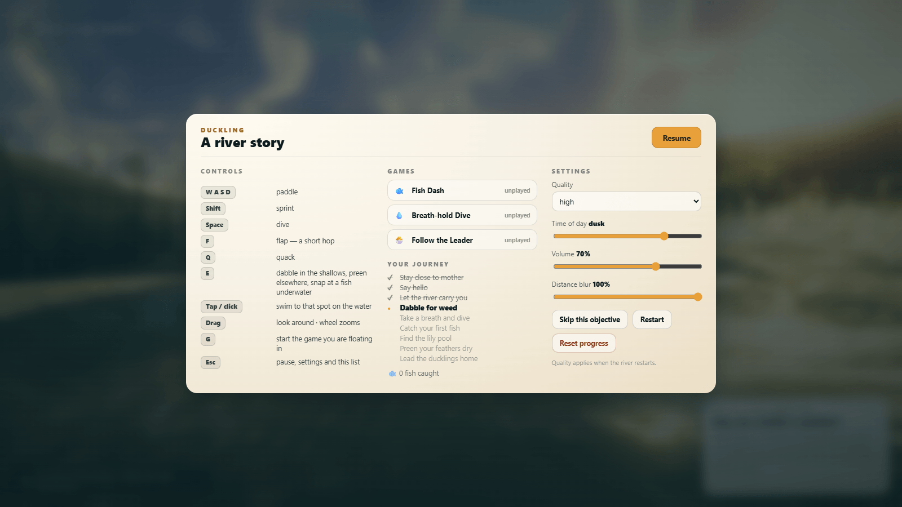

# Duckling — A River Story

A third-person duck adventure on a living river, built with [three.js](https://threejs.org/) and
Vite. You are a duckling on your first day: paddle after the hen, learn to quack, let the current
carry you downstream, dabble in the shallows, hold your breath and dive, catch a fish, find the
lily pool, preen your feathers dry and finally lead the brood home. Each of the nine steps comes
with a short, true fact about ducks, and three mini-games (Fish Dash, Breath-hold Dive, Follow the
Leader) are floating on the river for whenever you want to race yourself.

**Play online:** https://developmentation.github.io/duck-game/ (GitHub Pages, built from `main`
by `.github/workflows/deploy-pages.yml`).

## Screenshots

| | |
|---|---|
|  |  |
| *Morning on the river: paddle over to the hen* | *Two ducklings following, the rest of the brood ahead* |
|  |  |
| *Following the river downstream — the current is quickest in the middle* | *Up on the gravel bank among the reeds* |
|  |  |
| *Dusk over a broad pool* | *Esc: controls, mini-games, your journey and settings* |

## Controls

| Key | Action |
| --- | --- |
| W A S D | paddle |
| Shift | sprint (watch the stamina bar) |
| Space | dive — hold it; surface before the breath meter empties |
| F | flap — a short hop |
| Q | quack (the brood answers if they hear you) |
| E | dabble in the shallows, preen in deep water, snap at a fish underwater |
| G | start the mini-game you are floating in |
| Esc | pause, settings, controls and your journey |
| Tap / click | swim to that spot on the water |
| Drag / wheel | look around / zoom |

Touch devices get on-screen action buttons and a virtual stick. Settings (Esc) cover quality,
time of day, volume and distance blur; there are **Skip this objective**, **Restart** and
**Reset progress** buttons for when a grown-up needs to help.

## Run it locally

```sh
npm ci
npm run dev        # http://127.0.0.1:5173/
npm run build      # static site in dist/ (relative URLs, so it works from any sub-path)
npm run preview    # serve the build at http://127.0.0.1:4173/
```

`?q=low|medium|high` on the URL forces a quality tier. `npm run build:single` folds the whole
game into one self-contained HTML file (see `tools/bundle-single.mjs`; the last published one is
kept in `dist-single/`).

## How it is built

- `src/core/` — engine (renderer, composer, clock), input, events, settings, noise.
- `src/world/` — river spline and terrain, water, sky, trees, vegetation; `underwater.js` and
  `src/entities/wildlife.js` are intentionally stubbed placeholders (see `CONTRACT.md`).
- `src/entities/` — the player duck, the hen and brood, fish, particles, camera rig.
- `src/gameplay/` — quests (the nine-step journey and its lessons), mini-games, HUD, synthesised audio.
- `src/render/` — atmosphere, ground and water materials, post-processing (bloom, depth of field).
- `tools/` — development harnesses (screenshot and control tests, river verification, bundle tools).
  `CONTRACT.md`, `CRITIQUE.md` and `INTEGRATION_NOTES.md` are the design and review notes.

All geometry, textures and sound are generated in code; there are no third-party art or audio
assets. Dependencies: three.js (MIT) and Vite.
